# 🧠 Research Paper Summarization & Podcast API

> **Problem Statement:**  
Staying updated on research across multiple fields is challenging and time-consuming. Create a system that can search for relevant research papers, process them, organize and summarize them by topic, and create accessible audio summaries.

---

## 🚀 Project Overview

I built a **FastAPI-based backend service** that allows users to:
- Upload academic papers (PDF)
- Extract research topics
- Generate long-form LLM-based summaries (via DeepSeek)
- Synthesize multiple paper summaries into one
- Generate audio podcasts from summaries (gTTS)
- Search research papers using arXiv API

It’s modular, API-first, and designed for integration with an interactive frontend.

---

## 🔍 Focus Areas

- 🧱 Modular architecture with isolated agents
- 🚀 API-first development with FastAPI
- 📆 Clear separation: upload, summarize, audio, classify, search, synthesize
- 🧠 LLM (DeepSeek via OpenRouter) integration or Higging Face Facebook-Bert Model 

---

## 🧪 Technology Choices

| Component          | Tech Used                  | Justification                          |
|-------------------|----------------------------|----------------------------------------|
| Backend Framework | FastAPI                    | Fast, async-ready, great with OpenAPI  |
| Summarizer        | DeepSeek (via OpenRouter)  | Cutting-edge LLM for summarization     |
| Audio Generator   | gTTS (Google TTS)          | Lightweight and effective TTS          |
| PDF Parser        | PyMuPDF                    | Accurate and fast                      |
| Deployment        | Render                     | Quick cloud deployment                 |
| summarization     | Facebook-Bert Model        | Quick Without Api-Key set up           |
---

## 🧹 Features

| Feature               | Description                              |
|----------------------|------------------------------------------|
| 📄 PDF Upload         | Accepts and stores academic PDFs         |
| 🧠 Text Extraction    | From PDF or direct URL                   |
| 🧪 Topic Classification | Using Jina Embeddings                   |
| ✍️ Summarization      | Detailed summary using DeepSeek LLM      |
| 🔊 Podcast Audio      | Converts summaries to `.mp3`             |
| 📚 Paper Search       | Pulls results from arXiv                 |
| 🧵 Cross-Paper Synthesis | Smart merging of multiple summaries     |

---

## 📁 Folder Structure

```
.
├── main.py                  # FastAPI app
├── requirements.txt         # Python dependencies
├── agents/                  # Individual agents
│   ├── processing_agent.py
│   ├── topic_classifier.py
│   ├── summarizer_agent.py
│   ├── podcast_agent.py
│   ├── search_agent.py
│   └── synthesis_agent.py
├── uploads/                 # Uploaded PDFs
├── audio/                   # Output podcast audio
```

---

## 🔌 API Endpoints

| Endpoint         | Method | Description                        |
|------------------|--------|------------------------------------|
| `/upload/`       | POST   | Upload a research paper (PDF)      |
| `/classify/`     | POST   | Classify topic of uploaded paper   |
| `/summarize/`    | POST   | Summarize a single uploaded paper  |
| `/audio/`        | POST   | Convert summary to `.mp3` audio    |
| `/search/`       | GET    | Search papers using arXiv API      |
| `/process/url/`  | POST   | Extract text from a research URL   |
| `/synthesize/`   | POST   | Merge multiple summaries intelligently |

**Sample Input (for `/classify/`):**
```json
{
  "filename": "Real-Time_Detection_of_AI-Generated_Deepfake_Audio_A_Novel_Approach.pdf",
  "topics": ["AI", "Cybersecurity", "Audio Forensics"]
}
```

---

## ⚙️ Setup Instructions

### Local 

```bash
# Step 1: Install Python deps
pip install -r requirements.txt

# Step 2: Run the FastAPI app
uvicorn main:app --reload
```

Visit: [http://127.0.0.1:8000/docs](http://127.0.0.1:8000/docs)

---
wait for sometimes it may show error but for sometimes but start automatically due to high weight models being used .

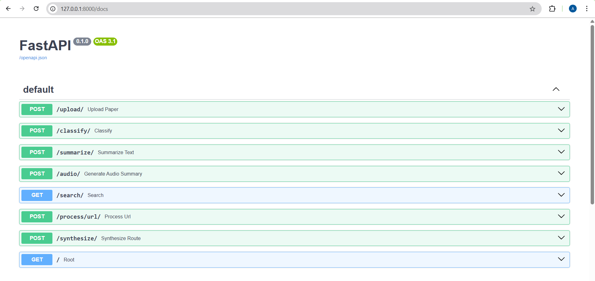

## 🧠 Multi-Agent Overview

| Agent              | Role                                     |
|-------------------|------------------------------------------|
| `processing_agent`| Extract text from PDF or URLs            |
| `topic_classifier`| Classify paper using topic embeddings    |
| `summarizer_agent`| DeepSeek-based summarization             |
| `podcast_agent`   | Generate `.mp3` audio via gTTS           |
| `search_agent`    | Search academic papers via arXiv API     |
| `synthesis_agent` | Smart merge of multiple paper summaries  |

---

## 🧪 Sample File Provided

- ✅ `Real-Time_Detection_of_AI-Generated_Deepfake_Audio_A_Novel_Approach.pdf`  
Upload this via `/upload/` and use in `/summarize/`, `/audio/`, `/classify/`.

---

## 🗀 Screenshots or Demo

###  Upload
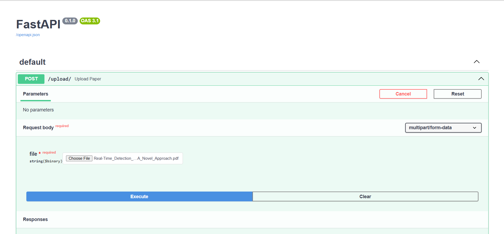
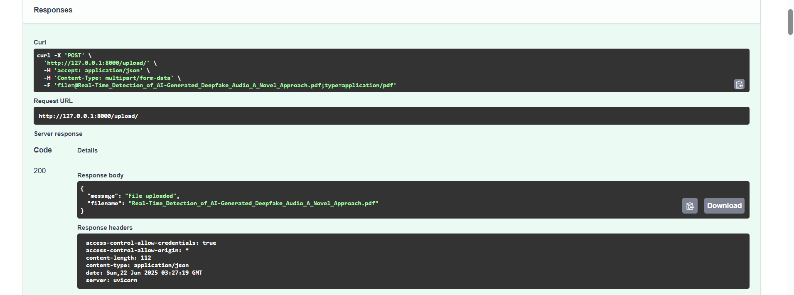

###  Summarize
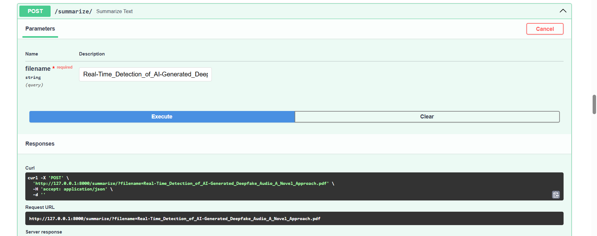
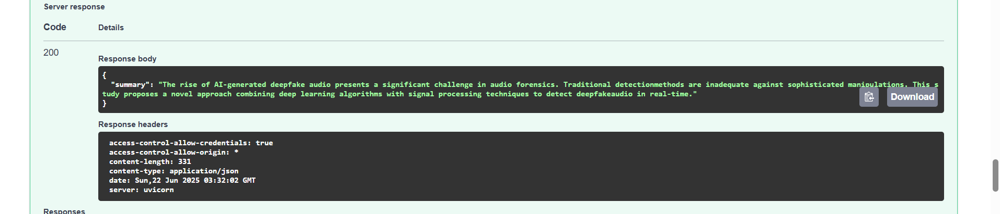

###  Audio
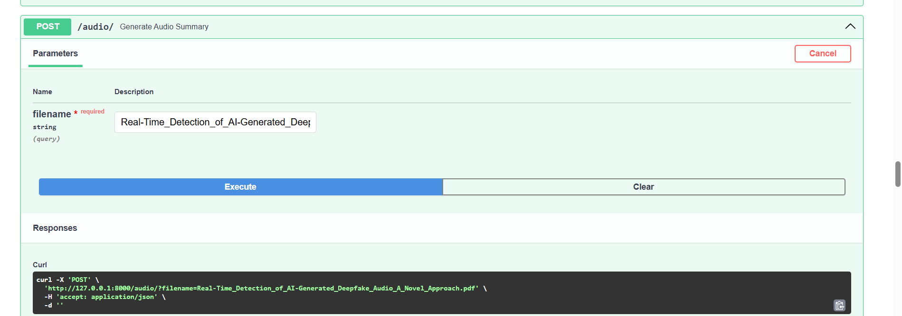
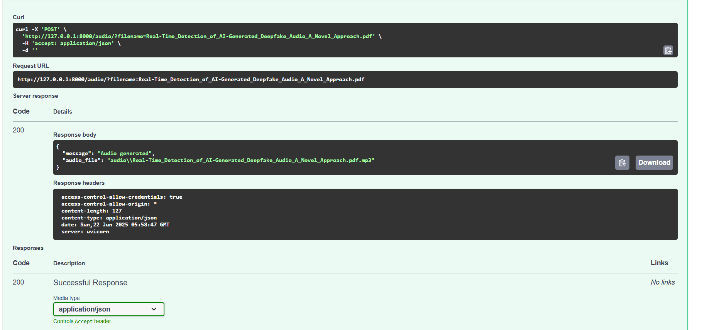

###  classification
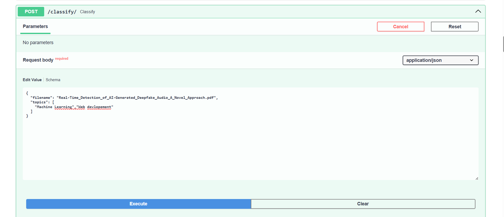
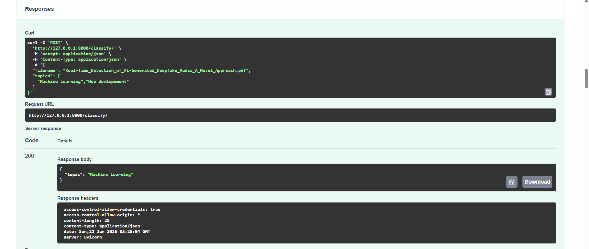

###  Search
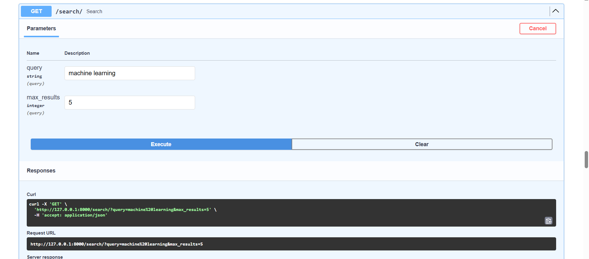
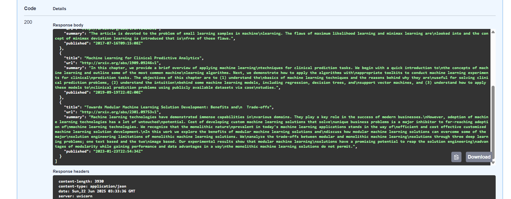

### process_url
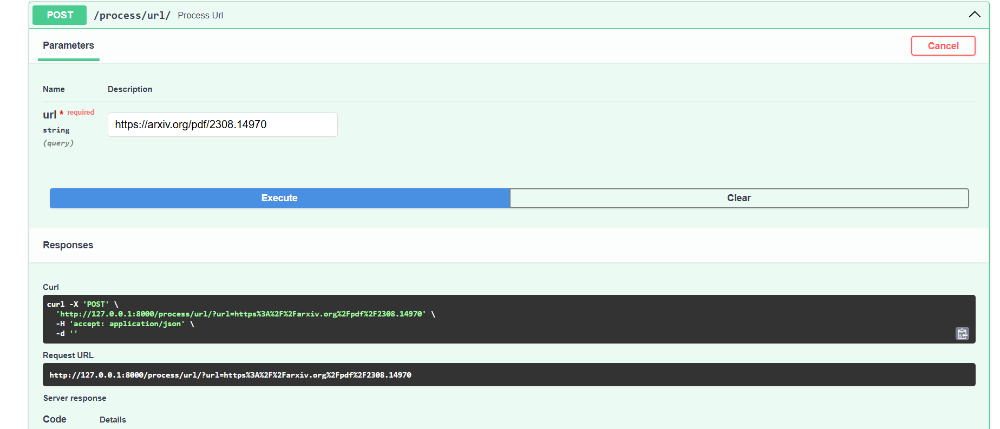
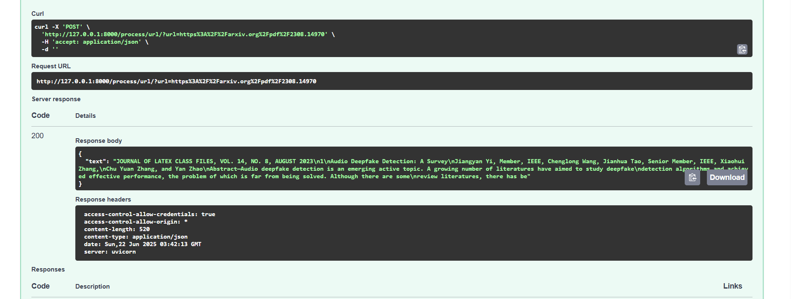


### synthesize
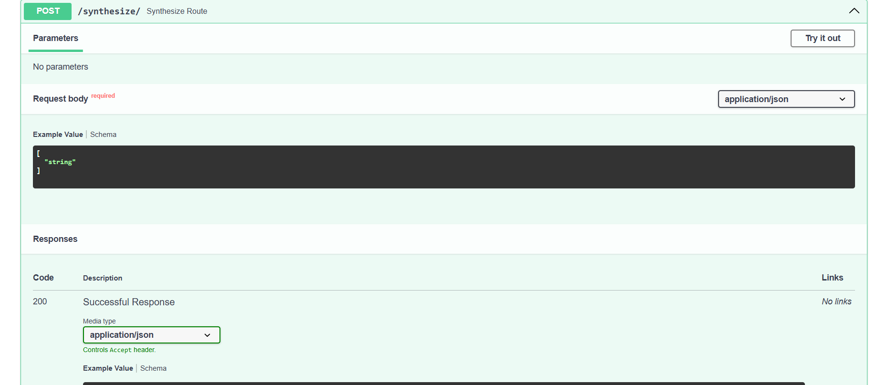


> To include screenshots:
1. Create a folder `screenshots/` in your GitHub repo
2. Upload your PNG/JPG files
3. Use Markdown syntax: ``

---

## 🧠 Justification & Design Decisions

- Used DeepSeek LLM for long-form summarization (better than DistilBART for this task)
- used Facebook-Bert Model for easy without Api Key set up
- FastAPI chosen for its speed, async support, and native Swagger docs
- Clear separation of concern: each function is handled by a dedicated agent

---

## 🧠 Final Notes

This project showcases:
- ✅ LLM integration (DeepSeek/OpenRouter)
- ✅ Modular backend architecture
- ✅ Core ML + NLP pipeline
- ✅ Real-world APIs + tools
- ✅ Production deployment on Render

---
